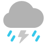
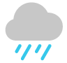
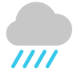
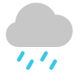
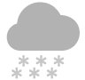
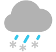

# 天气图标说明

来源：Apple iPhone 天气 App 官方图标

## 图标列表

| 图标 | 文件名 | 天气描述 |
|------|--------|----------|
|  | Sunrise.png | 日出 |
|  | Sunset.png | 日落 |
|  | Sunny.png | 晴朗无云/大部晴朗无云 |
|  | PartlySunny.png | 局部多云 |
|  | Haze.png | 雾霾 |
|  | Fog.png | 雾 |
|  | Wind.png | 有风/微风 |
|  | Cloudy.png | 多云 |
|  | ThunderBolt.png | 雷暴雨 |
|  | Rain.png | 有雨 |
|  | HeavyRain.png | 暴雨 |
|  | Drizzle.png | 微雨/冻细雨 |
|  | Snow.png | 下雪 |
|  | ScatteredSnow.png | 大雪/暴风雪 |
|  | Sleet.png | 冻雨/雨夹雪/混合雨雪 |
|  | ClearNight.png | 晴朗无云/大部晴朗无云（夜间） |
|  | PartlyCloudyNight.png | 局部多云（夜间） |
|  | NightDrizzle.png | 微雨（夜间） |

## 分类

### 日间天气
- **晴天**: Sunny.png, PartlySunny.png
- **多云**: Cloudy.png
- **雨天**: Drizzle.png, Rain.png, HeavyRain.png, ThunderBolt.png
- **雪天**: Snow.png, ScatteredSnow.png, Sleet.png
- **特殊**: Haze.png, Fog.png, Wind.png

### 夜间天气
- **晴天**: ClearNight.png, PartlyCloudyNight.png
- **雨天**: NightDrizzle.png

### 日出日落
- Sunrise.png, Sunset.png
